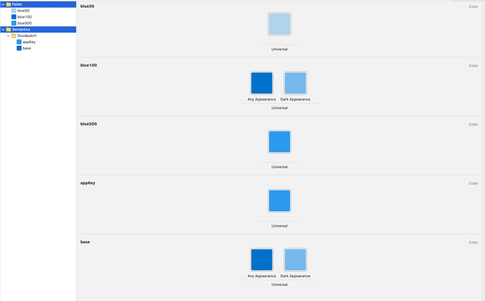

# ColorJSONConverter α 版

独自のフォーマットから Xcode のカラーアセットを作成できる CLI ツールおよび macOS アプリです。
※ 実運用しつつアップデートしているため一部ここに記載されていない使用方法が存在しています。

## 使い方

```sh
$ make install
$ cjc convert color.json Generated
```

もしくは

```sh
$ make open
```

でプロジェクトを開いたのちに実行すると以下のような GUI で操作が可能です。


### 注意

- 最後の引数を指定しない場合は Color.xcassets に固定になります
- コマンドを実行した場所に作成されます
- `cjc help`で簡易的なヘルプを表示できます

## JSON の書き方

- 必ず`pallets`を用意してください
- 色の指定は 16 進数表記、もしくは RGB 指定で行えます（RGB は 0 から 255 の整数、alpha 値は 0.0kara1.0 で指定）
- パレットの色名は baseName + label で表されます。

```json:sample.json
{
  "pallets": [
    {
      "baseName": "blue",
      "colors": [
        {
          "label": "50",
          "colorContext": "universal",
          "red": 177,
          "green": 210,
          "blue": 237
        },
        {
          "label": "100",
          "colorContext": "light",
          "hex": "0B6FCA"
        },
        {
          "label": "100",
          "colorContext": "dark",
          "hex": "#76B7ED"
        },
        {
          "label": "500",
          "colorContext": "universal",
          "hex": "3097ED"
        },
      ]
    }
  ],
  "colorFolders": [
    {
      "name": "Goodpatch",
      "folders": [],
      "colors": [
        {
          "name": "appKey",
          "colorContext": "universal",
          "value": "blue500"
        },
        {
          "name": "base",
          "colorContext": "light",
          "value": "blue100"
        },
        {
          "name": "base",
          "colorContext": "dark",
          "value": "blue100"
        }
      ]
    }
  ]
}

```

このファイルを実際にかけると以下のようなカラーアセットが生成されます



## ライセンス

[MIT License.](LICENSE)
